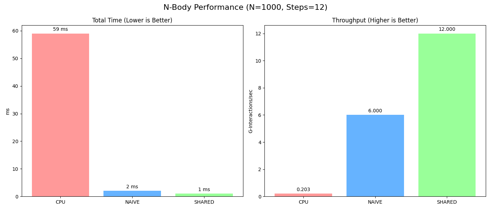
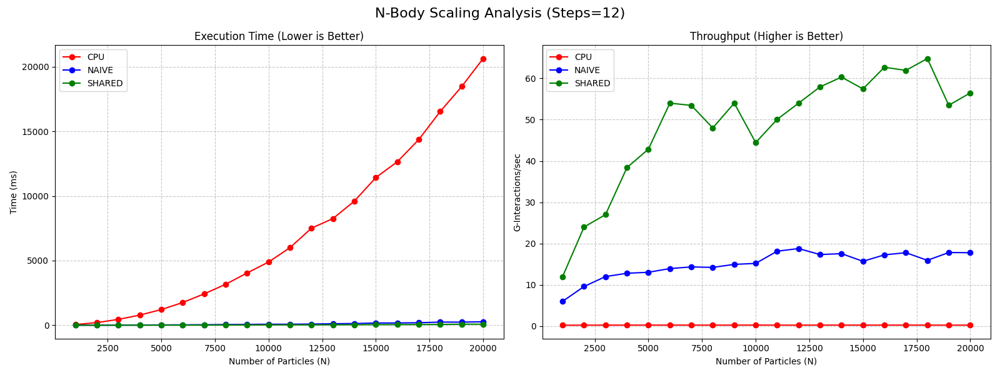

# High-Performance CUDA N-Body Simulation

   

A high-performance gravitational N-Body simulation engine built with **C++ and CUDA**. This project demonstrates the evolution of systems optimization—starting from a standard $O(N^2)$ CPU implementation, progressing to a Naive GPU port, and culminating in a highly optimized **Shared Memory Tiling** implementation that achieves over **60 Giga-Interactions/second**.

It features real-time **OpenGL/CUDA Interoperability**, allowing for the rendering of tens of thousands of particles at 60 FPS without CPU-GPU memory copying bottlenecks.

---

## Features

* **Three Simulation Strategies:**
    * **CPU:** Standard reference implementation (Baseline).
    * **GPU Naive:** Direct port to CUDA Global Memory.
    * **GPU Shared:** Optimized Tiled Algorithm using Shared Memory (L1 Cache) to minimize VRAM bandwidth.
* **Zero-Copy Visualization:** Uses CUDA-OpenGL Interop to render particles directly from GPU memory.
* **Automated Benchmarking:** Python scripts to validate performance and generate scaling graphs.
* **Modular Architecture:** Strategy Pattern design for easy switching between implementations.

---

## Building the Project

### Prerequisites
* **NVIDIA GPU** (Compute Capability 6.0+)
* **CUDA Toolkit** (11.0+)
* **CMake** (3.10+)
* **OpenGL / GLEW / GLFW**
* **Python 3** (for benchmarking)

### Compilation
```bash
# 1. Clone the repository
git clone <your-repo-url>
cd nbody_simulation

# 2. Create build directory
mkdir build && cd build

# 3. Configure and Build
cmake ..
make

```

---

## 💻 Usage

The executable accepts command-line arguments to control the simulation parameters, strategy, and running mode.

```bash
./nbody_modular [N] [STEPS] [STRATEGY] [MODE]

```

| Argument | Description | Options |
| --- | --- | --- |
| `N` | Number of particles | Integer (e.g., `10000`) |
| `STEPS` | Simulation steps | Integer (e.g., `100`) |
| `STRATEGY` | Compute Engine | `cpu`, `naive`, `shared` |
| `MODE` | Runtime Mode | `benchmark`, `visual`, `visual_vbo` |

**Examples:**

```bash
# Run a 20,000 particle simulation with Shared Memory and OpenGL VBO Visualization
__NV_PRIME_RENDER_OFFLOAD=1 __GLX_VENDOR_LIBRARY_NAME=nvidia ./nbody_modular 20000 1000 shared visual_vbo

# Run a quick CPU benchmark
./nbody_modular 1000 20 cpu benchmark

```

---

## 📊 Benchmarking & Performance Analysis

This project includes two Python automation scripts to rigorously test performance scaling.

### 1. How to Run Benchmarks

Ensure you have `matplotlib` installed (`pip install matplotlib`).

**A. Single Snapshot Benchmark (`benchmark.py`)**
Runs a quick comparison of all three strategies at a fixed N (default 1000). Good for a quick sanity check.

```bash
python3 bemchmarking/benchmark.py

```

**B. Full Scaling Sweep (`benchmark_sweep.py`)**
Runs a comprehensive stress test, increasing N from 1,000 to 20,000. This generates the scaling graphs used to prove algorithmic superiority.

```bash
python3 bemchmarking/benchmark_sweep.py

```

---

### 2. Results Discussion

The following results demonstrate the massive speedup achieved by moving from CPU to GPU, and the further optimization gained by managing memory access patterns.

#### 📉 Snapshot: Low Particle Count (N=1,000)

<p align="center">
  
</p>

Even at a low particle count, the GPU overhead is negligible compared to the raw throughput gains.

* **CPU:** 59ms (~0.2 G-Interactions/sec).
* **GPU Naive:** 2ms. Already **29x faster** than CPU.
* **GPU Shared:** 1ms. **2x faster** than Naive.

#### 📈 Scaling Analysis: High Particle Count (N=1,000 - 20,000)
<p align="center">
  
</p>

The true bottleneck of N-Body simulations is memory bandwidth. As N increases, the simulation performs N*N interactions.

**Key Observations:**

1. **CPU (Red Line):**
* Exhibits classic  exponential decay.
* At 20k particles, the CPU takes **>20 seconds** per frame, making it unusable for real-time applications.


2. **GPU Naive (Blue Line):**
* **Throughput Saturation:** The Naive implementation plateaus at roughly **18 G-Interactions/sec**.
* **Bottleneck:** Every thread reads particle positions from Global Memory (VRAM) repeatedly. The compute cores spend most of their time waiting for data.


3. **GPU Shared Memory (Green Line):**
* **The "Kill Shot":** By loading tiles of particles into **Shared Memory** (L1 Cache), we reduce global memory access by a factor of `BLOCK_SIZE` (256x).
* **Performance:** It does not plateau like the Naive version. It climbs to **~60 G-Interactions/sec**.
* **Result:** At N=20k, the Shared Memory implementation is **~3.3x faster** than the Naive GPU version and **thousands of times faster** than the CPU.


---

## 📜 Technical Details

* **Integrator:** Symplectic Euler (Semi-implicit).
* **Precision:** Single Precision (Float32).
* **Architecture:**
* **Host:** Manages initialization and visualization window.
* **Device:** Handles all physics calculations.
* **Interop:** `cudaGraphicsMapResources` maps OpenGL Vertex Buffer Objects (VBOs) into CUDA address space, allowing kernels to write directly to the screen buffer.


```